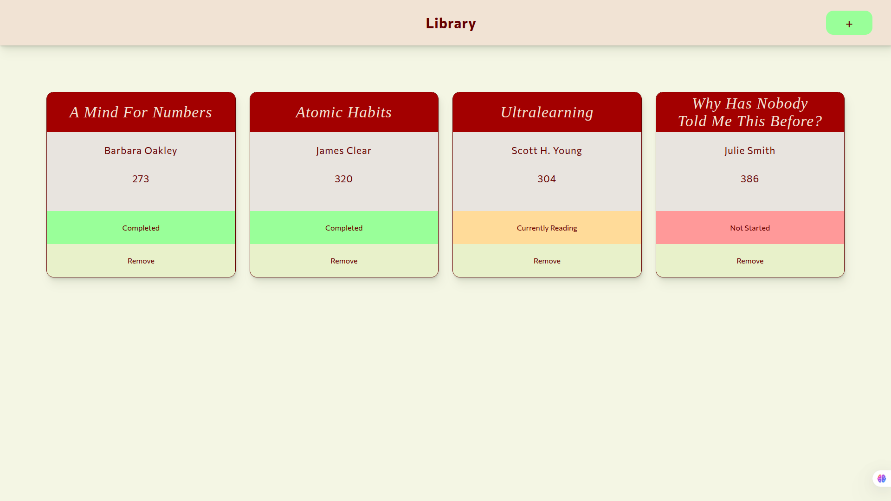

# library
**A simple library app built with HTML, CSS, and JavaScript.** 

# Page preview

## Features 
- A form for adding a book, it takes the following data : 
    - The name of the book
    - The name of the author
    - The number of pages
    - An option to select whether you have read the book, currently reading, or not started reading it yet

- A card for each book that includes and displays all the data above

## How to run
[Live preview](https://abdulwhab-elghareeb.github.io/library/)